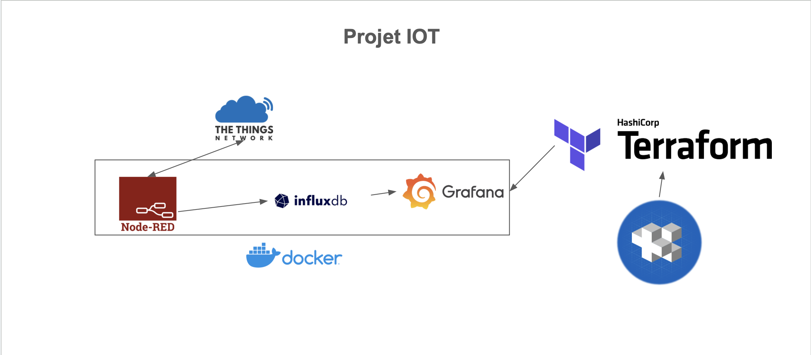
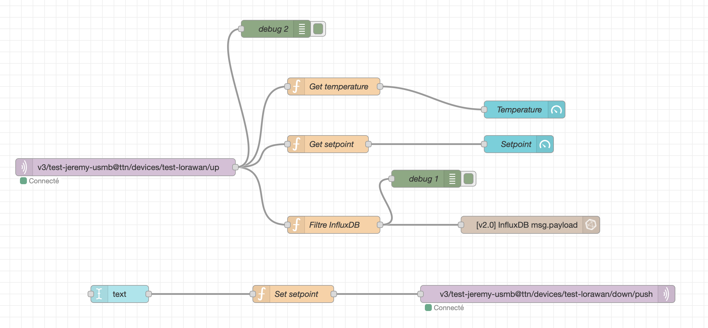

# IoT

Schéma du projet :



Flux Node Red :



Pour initialiser le projet :

```bash
go install github.com/google/go-jsonnet/cmd/jsonnet@latest

go install -a github.com/jsonnet-bundler/jsonnet-bundler/cmd/jb@latest
```

Dans le dossier du projet :

```bash
jb install github.com/grafana/grafonnet/gen/grafonnet-latest@main
```

Si besoin, ajouter le chemin `~/go/bin` dans la variable d'environnement PATH

Pour déployer :

```bash
terraform init
terraform plan
terraform apply
```